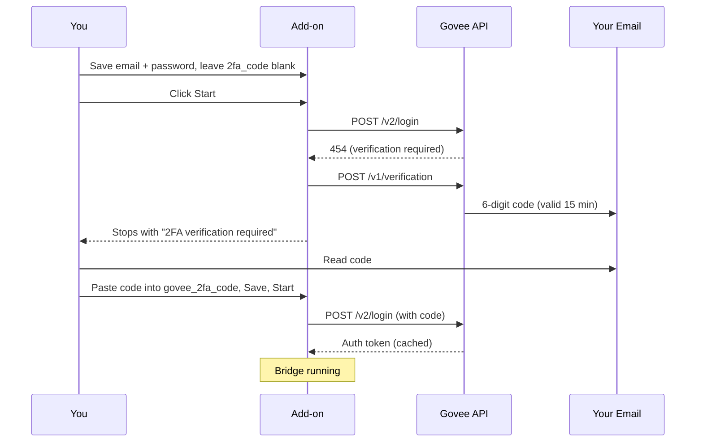

# Govee2MQTT (2FA Fix)

A Home Assistant Add-on that bridges [Govee](https://govee.com) devices to Home Assistant via MQTT.

This is a community fork of [wez/govee2mqtt](https://github.com/wez/govee2mqtt) that adds **2FA / email-verification login support** for the March 2026 Govee server-side block.

> **This is a temporary fork.** It exists only to patch the 2FA / email-verification login flow that broke `wez/govee2mqtt` in March 2026. As soon as upstream merges 2FA support, switch back. No new non-2FA features will land here.

## Why this fork?

In **March 2026**, Govee added mandatory email-verification on undocumented-API logins. Every login attempt with email + password returns server-side status `454` and a 6-digit code is emailed to the account. The original `govee2mqtt` did not handle this flow at the time of forking, which makes the Internal API features (per-segment color, scenes, DreamView, IoT push) unusable.

This fork adds:

- **Status 454/455 handling** — recognises the new server-side 2FA challenge.
- **Automatic verification trigger** — the bridge calls Govee's `/v1/verification` endpoint when it sees 454, so a code is emailed to your account.
- **Configurable code injection** — set `govee_2fa_code` in the add-on config (or `GOVEE_2FA_CODE` env var), restart, login completes within the ~15-minute code window.
- **Updated `APP_VERSION`** to match the current Govee Home iOS app.
- **`/v2/login` endpoint** with the headers Govee currently expects.

Everything else upstream from `wez/govee2mqtt` and the [`sitapix/govee2mqtt`](https://github.com/sitapix/govee2mqtt) community work (per-device JSON config hot-reload, fan support, group lights, air-quality sensors, scene quick-cycle, web UI) is preserved.

## Installation

### As a Home Assistant Add-on (recommended)

1. In Home Assistant, open **Settings → Add-ons → Add-on Store**.
2. Click the menu (⋮) in the top-right → **Repositories**.
3. Add this URL: `https://github.com/fat-fred/govee2mqtt-2fa`
4. Find **Govee2MQTT (2FA Fix)** in the store list, open it, click **Install**.
5. Enable the **Mosquitto Broker** add-on if you don't already have an MQTT broker running.

See [docs/ADDON.md](docs/ADDON.md) for the full walkthrough.

### As a Docker container

See [docs/DOCKER.md](docs/DOCKER.md) for `docker-compose` usage.

## First-Run 2FA Flow

Step-by-step:

1. Configure the add-on with `govee_email` + `govee_password` + (optional) `govee_api_key`. Leave `govee_2fa_code` **empty**.
2. Click **Start**. The add-on will attempt to log in, hit the 454 challenge, ask Govee to email you a code, and stop with the message *"2FA verification required..."*.
3. Open the email Govee sent you. Copy the 6-digit code.
4. Re-open the add-on configuration, paste the code into `govee_2fa_code`, click **Save**.
5. Click **Start** again. The add-on logs in with the code, the auth token is cached, and the bridge stays running.
6. Once logged in, you can clear `govee_2fa_code` from the config (or leave it — it is ignored if the token cache is still valid).

If the code expires before you can paste it (~15 min), just clear `govee_2fa_code` and restart — a new code will be emailed.

## What it provides (inherited from upstream)

These are upstream `wez`/`sitapix` features, not this fork's additions:

- LAN-first device control (lowest latency, works offline for supported devices).
- Per-segment colour control on RGBIC strips.
- Scene / DIY-Scene / music-mode select entities.
- Real-time push state via Govee's MQTT (requires `govee_api_key`).
- Per-device config overrides via JSON file (hot-reloaded).
- Web UI for device controls, log streaming, bridge health.
- Graceful shutdown with proper MQTT offline status.
- Persistent device DB for offline / degraded mode.

## Configuration

Common options (full list in [addon/DOCS.md](addon/DOCS.md) and [docs/CONFIG.md](docs/CONFIG.md)):

| Option | Purpose |
|---|---|
| `govee_email` | Govee account email — required for Internal API features (DreamView, scenes, room names) |
| `govee_password` | Govee account password |
| `govee_2fa_code` | Set after Govee emails you a 6-digit code. Leave blank on first run. |
| `govee_api_key` | Govee Developer API key — enables official Platform API (scenes, segments, music modes, push updates) |
| `mqtt_host` / `mqtt_port` / `mqtt_username` / `mqtt_password` | Override broker auto-discovery |
| `temperature_scale` | `C` or `F` |
| `debug_level` | Rust log filter, e.g. `govee=debug` |

If `mqtt_host` is left empty the add-on auto-discovers the Mosquitto broker via Home Assistant Supervisor.

## Source provenance & credits

- **Original project & MIT license:** [Wez Furlong](https://github.com/wez) — [`wez/govee2mqtt`](https://github.com/wez/govee2mqtt). All core LAN/cloud bridging, MQTT integration, web UI, and per-segment control is his work.
- **Community fork with extended features:** [`sitapix/govee2mqtt`](https://github.com/sitapix/govee2mqtt) — per-device JSON config hot-reload, fan/group-light/air-quality support, scene quick-cycle, and the underlying 2FA implementation this fork ships.
- **2FA implementation reference:** [PR #656 by nungster](https://github.com/wez/govee2mqtt/pull/656) on the upstream repo.
- **This fork:** packages the 2FA fix as a Home Assistant add-on with build infrastructure (per-arch GHCR images via `home-assistant/builder`).

Released under MIT, same as upstream. See [LICENSE.md](LICENSE.md) for full attribution.

## License

MIT — same terms as upstream `wez/govee2mqtt`.
